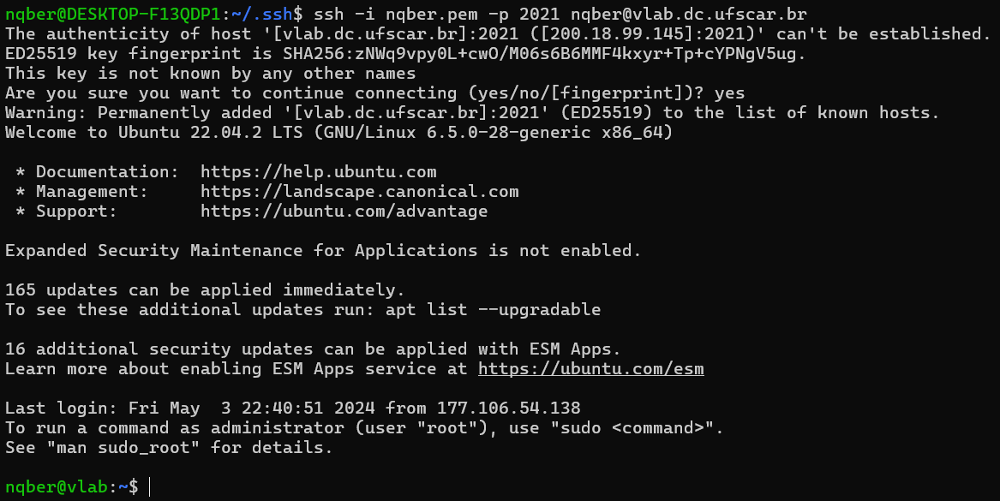

# Tutorial de SSH

Então você decidiu que quer acessar o servidor usando _**SSH?**_
Mas...
## Por que SSH?
Os nossos computadores de uso pessoal geralmente já vem equipados de uma tela cheia de softwares bonitinhos e clicáveis (GUI), entretanto, muitas vezes em servidores isso é desnecessário! Isso porque, a parte direcionada ao usuário será desenvolvida e além disso sessões gráficas gastam recurso do servidor, principalmente se inutilizadas

Ok... mas então **como** vamos acessar o servidor?

## O que é SSH?
No linux ganhamos experiência com o uso de terminais para executar diversas tarefas e programas, a ideia do SSH é habilitar que nós utilizemos a interface de comando do servidor, de fato, SSH quer dizer _**Secure Shell**_

## Como utilizar/configurar ssh?
## Configurando SSH no Windows
> WSL é um sistema que possibilita utilizar várias ferramentas de linux num ambiente windows, o que pode ser muito útil em várias situações [instalação](#instalação-wsl-pra-quem-quer)

### Pra quem tem WSL
O processo de quem WSL é o mesmo do Linux então
[Clica aqui]()
### Pra quem não tem e não quer instalar WSL
O tutorial é semelhante ao do linux entretanto é necessário fazer as seguintes substituições:

~/.ssh/ -> C:\\Users\\SEUUSUARIO\\.ssh

~/.ssh/config -> C:\\Users\\SEUUSUARIO\\.ssh\\config

Para ajustar as [permissões da chave privada](#o-que-é-e-por-que-ajustar-a-permissão-da-chave-privada) será diferente!!
siga este [link](https://superuser.com/a/1296046)

### Instalação WSL pra quem quer
A instalação do WSL é mais simples do que você imagina! Olha que bom!
Apenas abra o programa __powershell__ que já vem instalado no windows

Para isso aperte **Win+R**, digite powershell e pressione *Enter*
```powershell
wsl --install
```
Após esse comando o WSL estará instalado no seu sistema!
> Entretanto será necessário **reiniciar o computador** para que o WSL fique disponível, isso abrirá um terminal perguntando usuário e senha para serem configurados no WSL


Após isso o WSL estará instalado no sistema.
[Voltar ao SSH](#pra-quem-tem-wsl)


## Configurando SSH no Linux
Como os servidores que iremos utilizar aceitam apenas autenticação pelo [método de chaves privadas](#o-que-bulhufas-é-uma-autenticação-por-chave-privada) o primeiro passo é conseguirmos nossas chaves privadas. No nosso caso, as nossas chaves privadas foram geradas e enviadas por **e-mail** para nós.
> (o que _geralmente_ não é ideal nem seguro, mas em nossas condições de temperatura e pressão isso é irrelevante)

No meu caso, a chave se chama **nqber.pem**


Antes de testarmos a conexão é necessário ajustar as 
permissões de acesso da chave privada [(por quê?)](#o-que-é-e-por-que-ajustar-a-permissão-da-chave-privada) e movê-la para um local mais organizado!

Isso pode ser feito da seguinte forma
```zsh
mkdir ~/.ssh # diretório padrão de configurações ssh
mv ~/Downloads/nqber.pem ~/.ssh/ # caminho da chave privada
chmod 0600 ~/.ssh/nqber.pem # permissões da chave
```
> Esse 0600 mágico é explicado [aqui](#o-que-é-e-por-que-ajustar-a-permissão-da-chave-privada)

Após isso podemos realizar uma conexão ssh da seguinte forma:
```zsh
ssh -i /caminho/para/a/chave/privada.pem -p 2021 usuario@vlab.dc.ufscar.br
```
o que no meu caso se torna (meu nome de usuário é **nqber**)
```zsh
ssh -i ~/.ssh/nqber.pem -p 2021 nqber@vlab.dc.ufscar.br
```
Acontece que o nosso computador nunca se conectou ao servidor _vlab.dc.ufscar.br_ (provavelmente, se não nao faria sentido você estar lendo isso!) então ele desconfia e pergunta se queremos mesmo estabelecer essa conexão:

Apenas digite `yes` e aperte **Enter**
> Isso só ocorrerá na primeira vez que você se conecta a um novo servidor

## Felicidade!
Agora você provavelmente estará diante do terminal do servidor!
Para verificar que está no servidor digite 
```zsh
echo Cheguei até aqui! > ~/sucesso.txt
ls /home
```
Isso listará as pastas dos outros usuários do sistema, seus coleguinhas, e escreverá um arquivo para que saibamos que você conseguiu se conectar!!
Palmas! Você até merece um descanso, mas não agora, pois não acabou!

**NÃO ACABOU!!!**

> O comando que utilizamos vai funcionar, mas o ssh permite a configuração do serviço para que não tenhamos que digitar comandos longos sempre e para facilitar qualquer manutenção

Sabemos que o diretório de configuração de um ssh é `~/.ssh/`
O arquivo de configuração é o `~/.ssh/config` e teremos que editá-lo utilizando um editor de texto (de sua preferência, caso não tenha um específico utilize o _nano_, como vou demonstrar)
> Lembrando que essa parte é feita no **SEU COMPUTADOR**, não no servidor

Utilizarei o nano para editar o arquivo em questão
```zsh
nano ~/.ssh/config
```
Isso abrirá um editor de texto no terminal, que é bem parecido com editores de texto normais, só que não é tao bonito (tadinho), você deverá escrever o seguinte:
(substituindo o usuário pelo seu e o caminho da chave privada também)
```conf
# O nome "vlab" é o que utilizaremos para a conexão 
# poderíamos colocar qualquer coisa nesse campo Host vlab
# poderia ser Host banana
Host vlab
    HostName vlab.dc.ufscar.br # o vlab daqui ja não pode ser diferente, pois faz parte do domínio do servidor
    User nqber
    Port 2021
    IdentityFile /home/nqber/.ssh/nqber.pem


# Este servidor "antigo-vlab" não será tão importante
# e também precisa de uma outra chave privada para aceitar
# a conexão então, por enquanto, não né necessário
Host antigo-vlab
    HostName 200.18.99.212
    User nqber
    Port 2021
    IdentityFile /home/nqber/.ssh/old-nqber.pem
```

Após essa configuração, o acesso fica mais simples!
```zsh
ssh vlab
```
ou ainda no servidor antigo
```zsh
ssh antigo-vlab
```

### O que bulhufas é uma autenticação por chave privada?
Resumidamente sua chave privada substitui o uso de uma senha e isso leva ao [tópico seguinte](#o-que-é-e-por-que-ajustar-a-permissão-da-chave-privada)
### O que é e por que ajustar a permissão da chave privada?
Como sua chave privada substitui uma senha e dá acesso ao servidor, o ideal é que apenas você consiga utilizá-la, isto é, outros usuários não devem ser capazes de ler o conteúdo de sua chave privada, portanto se torna necessário ajustar corretamente as permissões:

Basicamente um arquivo pode ter 3 permissões:
1. Leitura  (R)
2. Escrita  (W)
3. Execução (X)

Como todas as três são variáveis _booleanas_ (ou pode ser lido, ou não pode... ou pode ser escrito ou não pode...) é possível representar as permissões de modo binário

Um arquivo com as três permissões fica

RWX = 111 = 7

Um arquivo que apenas pode ser lido fica

R-- = 100 = 4

...

Entretanto, isso depende também do usuário, no linux a forma de permissão definida é a seguinte:


Ou seja, os 3 primeiros bits são para o usuário dono do arquivo, os 3 seguintes são para quem faz parte do grupo que cuida do arquivo e os últimos 3 bits são para usuários outros do sistema

Por isso, nossa chave privada tem o código 0600 (o zero precisa estar lá, não darei explicações agora pq to c mt sono, mas terá commit dps) = 0 110 000 000 = RW- --- ---

Logo, apenas você pode ler e alterar o arquivo